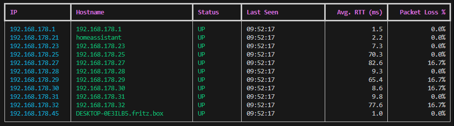

# Network Monitor (pingCheck)

Ein leichtgewichtiges, plattformübergreifendes Tool zur Netzwerküberwachung mit automatischer Host-Erkennung, Ping-Monitoring und Live-Dashboard.

## Features

- **Automatische Netzwerk-Erkennung**: Erkennt automatisch lokale Netzwerke und alle aktiven Hosts
- **Kontinuierliches Monitoring**: Pingt alle Hosts kontinuierlich und überwacht deren Status
- **Performance-Metriken**: Zeigt Response Times (RTT) und Packet Loss für jeden Host
- **Port-Scanning**: Scannt gängige Ports auf offene Verbindungen
- **Live-Dashboard**: Schönes Terminal-UI mit Rich Library für Echtzeit-Updates
- **Konfigurierbar**: Alle Einstellungen können über `config.ini` angepasst werden
- **Logging**: Protokolliert alle Statusänderungen und Ereignisse
- **Multi-threading**: Parallele Überwachung für optimale Performance
- **Cross-Platform**: Läuft auf Windows, Linux und macOS

## Installation

### Voraussetzungen

- Python 3.6 oder höher
- Administrator/Root-Rechte (für Netzwerk-Scanning)

### Abhängigkeiten installieren

```bash
pip install -r requirements.txt
```

Die benötigten Pakete sind:
- `python-nmap>=0.7.1` - Für Nmap-Integration
- `psutil>=5.9.0` - Für Netzwerk-Interface-Erkennung (ersetzt netifaces für bessere Kompatibilität)
- `rich>=13.7.0` - Für das Terminal-UI
- `python-dotenv>=1.0.0` - Für Umgebungsvariablen
- `setuptools>=65.5.0` - Für Paket-Management

### Optional: Als Python-Paket installieren

```bash
python setup.py install
```

## Verwendung

### Einfach starten

```bash
python network_monitor.py
```

Das Tool wird automatisch:
1. Alle lokalen Netzwerke erkennen
2. Alle aktiven Hosts im Netzwerk scannen
3. Mit dem Monitoring beginnen
4. Ein Live-Dashboard anzeigen

### Mit sudo (Linux/macOS)

Auf Linux und macOS sind Root-Rechte für Netzwerk-Scanning erforderlich:

```bash
sudo python network_monitor.py
```

### Als Administrator (Windows)

Auf Windows als Administrator ausführen.

## Konfiguration

Die Einstellungen können in der `config.ini` Datei angepasst werden:

```ini
[network]
network = auto              # 'auto' für automatische Erkennung oder z.B. '192.168.1.0/24'
scan_interval = 300         # Netzwerk-Scan-Intervall in Sekunden (5 Minuten)
timeout = 2                 # Ping-Timeout in Sekunden

[logging]
level = INFO               # Log-Level: DEBUG, INFO, WARNING, ERROR
file = network_monitor.log # Log-Datei-Pfad

[monitoring]
ping_count = 1             # Anzahl der Pings pro Check
update_interval = 5        # UI-Update-Intervall in Sekunden
max_history = 10           # Anzahl der Response-Time-Werte die gespeichert werden

[ports]
common_ports = 21,22,23,80,443,3389,5900  # Zu scannende Ports
```

## Dashboard

Das Live-Dashboard zeigt folgende Informationen für jeden Host:



- **IP**: IP-Adresse des Hosts
- **Hostname**: Aufgelöster Hostname (falls verfügbar)
- **Status**: UP (grün) oder DOWN (rot)
- **Last Seen**: Zeit des letzten erfolgreichen Pings
- **Avg. RTT**: Durchschnittliche Response-Time in Millisekunden
- **Packet Loss %**: Prozentsatz verlorener Pakete

### Steuerung

- `Ctrl+C`: Beendet das Monitoring

## Architektur

### Hauptkomponenten

- **network_monitor.py**: Hauptanwendung mit Monitoring-Logik und UI
- **nettool.py**: Legacy-Tool mit erweiterten Netzwerk-Funktionen
- **config_manager.py**: Konfigurationsverwaltung
- **logger.py**: Logging-System mit Host-spezifischen Loggern

### Datenstrukturen

- **HostStatus**: Trackt Status, Response-Times, Packet-Loss und offene Ports für jeden Host
- **NetworkMonitor**: Hauptklasse für Netzwerk-Discovery und Monitoring

## Legacy-Tool (nettool.py)

Das Projekt enthält auch ein älteres Tool `nettool.py` mit zusätzlichen Funktionen:

### Verfügbare Optionen

```bash
python nettool.py --domain <domain>      # Ping eine Domain
python nettool.py -d <domain>            # Ping eine Domain (kurz)
python nettool.py --ip <ip>              # Scan ein IP-Range
python nettool.py --subnet <subnet>      # Setze Subnet
python nettool.py -p                     # Starte Ping-Monitoring
python nettool.py --localIP              # Zeige lokale IPs
python nettool.py -lip                   # Zeige lokale IPs (kurz)
python nettool.py -a                     # Auto-Scan
python nettool.py --sip <x.x.x.x/xx>     # Subnet mit CIDR
python nettool.py --hostname             # Zeige Hostnames (langsamer)
```

### Beispiel

```bash
# Auto-Scan des lokalen Netzwerks mit Ping-Monitoring
python nettool.py -a -p

# Bestimmtes Subnet scannen
python nettool.py --sip 192.168.1.0/24 -p
```

## Troubleshooting

### Keine Hosts gefunden

- Stellen Sie sicher, dass Sie mit dem Netzwerk verbunden sind
- Überprüfen Sie die Firewall-Einstellungen
- Führen Sie das Tool als Administrator/Root aus

### Ping schlägt fehl

- Einige Firewalls blockieren ICMP-Pakete
- Überprüfen Sie die Timeout-Einstellung in `config.ini`

### Hostname-Auflösung funktioniert nicht

- Dies ist normal, wenn DNS nicht korrekt konfiguriert ist
- Die IP-Adresse wird stattdessen angezeigt

## Lizenz

MIT License

## Beiträge

Beiträge sind willkommen! Fühlen Sie sich frei, Issues zu öffnen oder Pull Requests zu erstellen.

## Autor

Erstellt vor 7 Jahren als persönliches Netzwerk-Monitoring-Tool.

